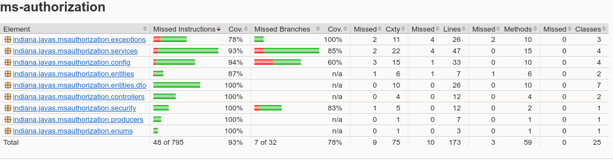

# Microsserviço de Autorização

Esse microsserviço é responsável pela autenticação e autorização de requisições na API.

## Requisitos

- Java 17
- SpringBoot 3.4.1
- PostgreSQL 17.0

## Rotas

| **Method** | **Base path** |
|------------|---------------|
| POST       | /users        |
| GET        | /users/:id    |
| PUT        | /users/:id    |
| POST       | /oauth/token  |

## Como executar apenas este microsserviço

O microsserviço pode ser executado diretamente pela IDE (IntelliJ, Eclipse, etc), de maneira integrada, ou, então,
executado manualmente com os seguintes comandos:

<small>OBS: A partir da pasta raíz do microsserviço</small>

```
./mvnw clean package
java -jar target/ms-authorization-0.0.1-SNAPSHOT.jar
```

## Exemplos de requisições

### POST /oauth/token

```http http request
POST http://localhost:8083/oauth/token
Content-Type: application/json

{
  "email": "admin@mail.com",
  "password": "admin123"
}
```

### POST /users

```http request
POST http://localhost:8083/users
Content-Type: application/json
Authorization: Bearer <token>

{
  "firstName": "Juca",
  "lastName": "Bala",
  "email": "juca@bala.com",
  "password": "12345678",
  "roles": ["ROLE_OPERATOR"]
}
```

<small>
OBS: Se nenhuma 'role' for informada na requisição, o usuário é automaticamente cadastrador com
'ROLE_OPERATOR'.
</small>

### GET /users/:id

```http request
GET http://localhost:8083/users/1
Authorization: Bearer <token>
```

### PUT /users/:id

```http request
PUT http://localhost:8083/users/1
Content-Type: application/json
Authorization: Bearer <token>

{
  "firstName": "Administrador",
  "password": "admin321",
}
```

<hr>

OBS: Utilizar um token JWT válido, obtido da rota de autenticação `/oauth/token`, no cabeçalho `Authorization` de todas
as requisições (com excessão da requisição para obtenção do token), no formato `Authorization: Bearer <token>`.

## Cobertura de testes

