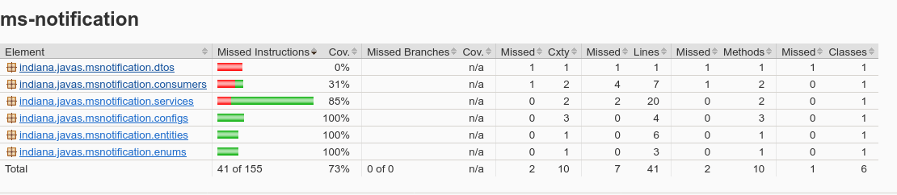

# Microsserviço de Autorização

Esse microsserviço é responsável pelo envio de notificações via _e-mail_ quando os dados de um usuário são alterados.
As notificações são lidas de uma fila do RabbitMQ.


## Requisitos

- Java 17
- SpringBoot 3.4.1
- PostgreSQL 17.0

## Como executar apenas este microsserviço

O microsserviço pode ser executado diretamente pela IDE (IntelliJ, Eclipse, etc), de maneira integrada, ou, então,
executado manualmente com os seguintes comandos:

<small>OBS: A partir da pasta raíz do microsserviço</small>

```
./mvnw clean package
java -jar target/ms-notification-0.0.1-SNAPSHOT.jar
```

## Cobertura de testes

